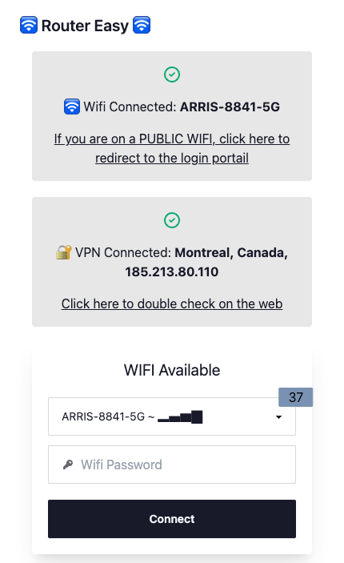
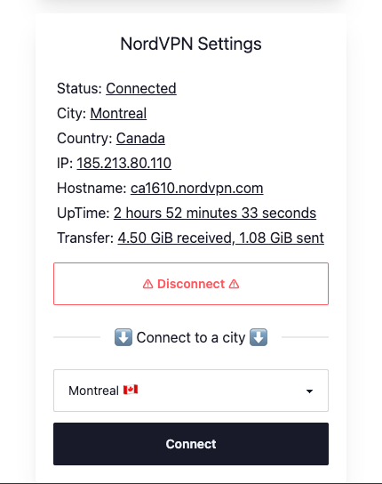
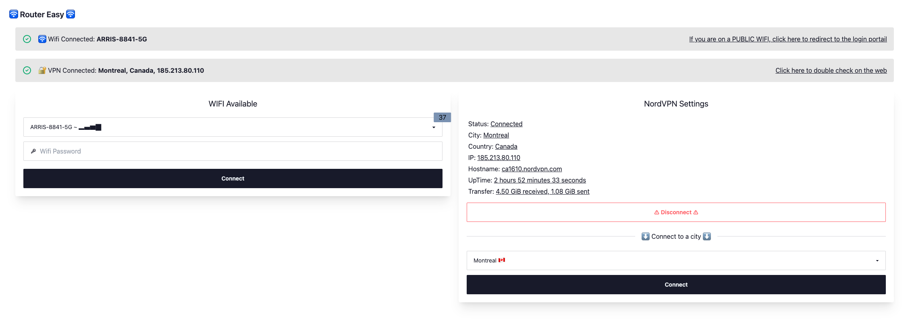

# Easy Router Project 🌐
The Easy Router Project is a **web application designed to simplify the configuration of a travel router setup on a Raspberry Pi**. It allows users to:  
- Connect to public WiFi networks
- Configure a secure VPN connection using NordVPN

The application serves as an interface for managing two network interfaces:  

1. The native Raspberry Pi interface for connecting to public WiFi
2. An additional WiFi adapter for creating a hotspot

This setup ensures a secure and private connection while traveling, with the added convenience of an easy-to-use web interface for managing connections.

## Screenshots 📺

[//]: # (Table with screenshots)
[//]: # (Table with screenshots)
| Screenshot                           | Description                            |
|--------------------------------------|----------------------------------------|
|  | Mobile View (Status and Wifi Settings) |
|  | Mobile View (Vpn Settings)             |
|      | Desktop View                           |

## Technologies Used ✨

The project is built using the following technologies:

- JavaScript: The primary programming language used for developing the application.
- TypeScript: Used for static typing in JavaScript.
- Node.js: The JavaScript runtime used to execute the server-side JavaScript code.
- Vue.js: The front-end framework used for building the user interface.
- Express.js: The web application framework used for building the API.
- NPM: The package manager for JavaScript, used for managing project dependencies.

## Installation and Setup ⚙️

⚠️ You will need two ifaces on your Raspberry Pi. One for the public WiFi and one for the hotspot. The hotspot iface should be named `wlan1` and the public WiFi iface should be named `wlan0`.

⚠️ NordVPN is required for the VPN connection. You will need to have a NordVPN account and a valid subscription to use the VPN feature. (https://nordvpn.com/)

To install and start the project on a Raspberry Pi, follow these steps:

1. Clone the project from the GitHub repository.
2. Navigate to the project directory in the terminal.
3. Install the project dependencies by running `npm install`.
4. Start the project by running `npm run dev`.

Please ensure that Node.js and NPM are installed on your Raspberry Pi before proceeding with the installation.

## Usage 💻

Once the project is running, you can access the application in your web browser by navigating to the IP address of your Raspberry Pi, followed by the port number (default is 80).

## Contributing 🤝

Contributions to the project are welcome ! 🚀 Please feel free to submit a pull request 🔀 or open an issue 🐛 on the GitHub repository.

